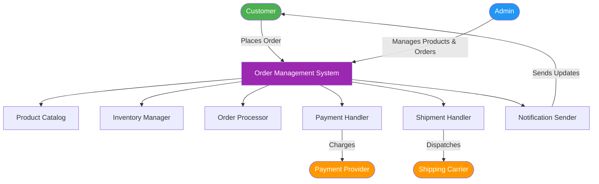
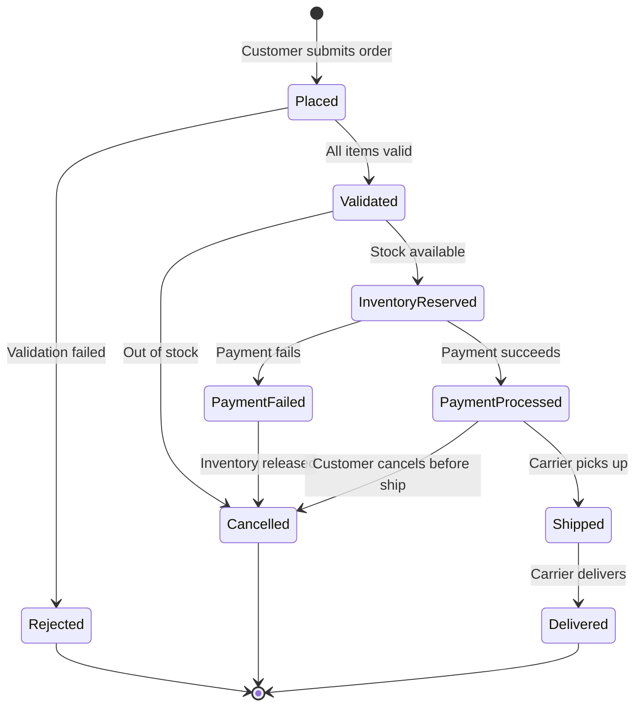
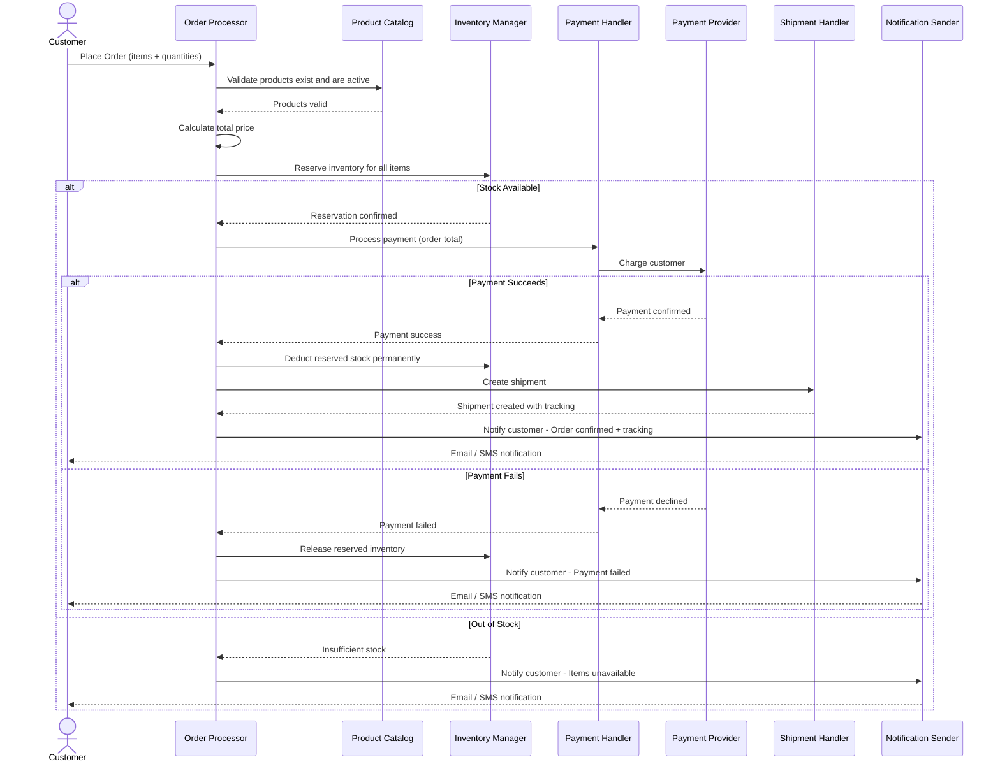
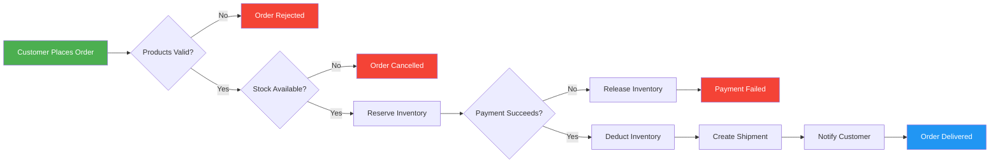

# Smart Order Management System (OMS) — Business & Domain Analysis

---

## PHASE 1 — BUSINESS MODEL

### What problem does an OMS solve?

Imagine a small online store. A customer picks items, pays, and expects delivery. Behind the scenes, the store must:

- Know what's in stock so it doesn't sell items it doesn't have.
- Track every order from the moment a customer clicks "Buy" to the moment the package arrives at their door.
- Collect payment reliably — and handle failures (card declined, insufficient funds).
- Coordinate shipping so the warehouse knows what to pack and send.
- Keep everyone informed — the customer wants updates; the admin wants reports.

Without an OMS, all of this is manual, error-prone, and doesn't scale. An OMS is the central brain that coordinates Products, Inventory, Orders, Payments, and Shipments into one reliable workflow.

---

### Who are the actors?

- **Customer**: Browses products, places orders, makes payments, receives shipments.
- **Admin**: Manages the product catalog, monitors orders, handles cancellations/refunds, views reports.
- **System (OMS)**: The software itself. It validates, coordinates, and enforces rules automatically.
- **Payment Provider**: External service (e.g., Stripe/PayPal) that charges the customer's card.
- **Shipping Carrier**: External service (e.g., FedEx/DHL) that physically delivers packages.

---

### Core objects

- **Product**: Catalog entry (name, price, description).
- **Inventory**: Tracks available and reserved quantities.
- **Order**: Customer's request to buy products.
- **Order Item**: A line item with product + quantity.
- **Payment**: Record of money charged.
- **Shipment**: Record of physical delivery.
- **Notification**: Messages sent to customer/admin.

---

### Order lifecycle (high level)

PLACED → VALIDATED → INVENTORY_RESERVED → PAYMENT_PROCESSED → SHIPPED → DELIVERED

Possible interrupts:
- Validation fails → REJECTED
- Inventory unavailable → CANCELLED
- Payment fails → PAYMENT_FAILED (inventory released)
- Cancellation request → CANCELLED (refund + inventory release)

---

## PHASE 2 — DOMAIN CONCEPTS

### Product

What is it?
- A catalog entry describing an item for sale.

Contains logically:
- ID, name, description, price, category, active flag.

Rules:
- Price > 0, name non-empty, inactive products cannot be sold.

Actions:
- Create, update, deactivate, and read for order building.

---

### Inventory

What is it?
- Tracks available quantity per product and reserved quantities for pending orders.

Contains logically:
- Product reference, total on-hand, reserved quantity, available = total − reserved.

Rules:
- Cannot reserve more than available; available quantity never negative.

Actions:
- Reserve, Release, Deduct, Restock.

---

### Order

What is it?
- The central document representing a customer's purchase request.

Contains logically:
- Order ID, customer reference, list of order items, total price, current state, timestamps.

Rules:
- At least one item; item quantity >= 1; total must match item sums; valid state transitions; delivered orders cannot be cancelled.

Actions:
- Place, validate, transition states, cancel (conditional).

---

### Payment

What is it?
- The financial transaction tied to an order.

Contains logically:
- Payment ID, order reference, amount, method label, status (Pending/Completed/Failed/Refunded), timestamp.

Rules:
- Amount must match order total; only attempt payment after validation and inventory reservation; on failure release inventory; refunds only for completed payments.

Actions:
- Initiate, record result, refund.

---

### Shipment

What is it?
- Represents physical delivery for an order.

Contains logically:
- Shipment ID, order reference, shipping address, carrier tracking number, status (Preparing/Shipped/In Transit/Delivered), ETA.

Rules:
- Created only for paid orders; delivered is final; one shipment per order (for simplicity).

Actions:
- Create, update by carrier, notify customer.

---

## PHASE 3 — SYSTEM FLOW

Step-by-step when a customer places an order:

1) Customer places order
- System creates an Order with state = PLACED.

2) System validates
- Checks product existence, active flags, positive quantities, and total price.
- On success → VALIDATED; on failure → REJECTED.

3) Inventory reserved
- System attempts to reserve each order item's quantity.
- If all succeed → INVENTORY_RESERVED; else → CANCELLED and notify customer.

4) Payment processed
- System initiates a Payment record and sends charge to Payment Provider.
- On success → PAYMENT_PROCESSED; on failure → PAYMENT_FAILED and inventory released.

5) Shipment created
- After successful payment, create Shipment, permanently deduct inventory, and hand off to carrier. State moves to SHIPPED when carrier picks up.

6) Notifications sent
- System notifies customer at each major state change (placed, payment success/fail, shipped, delivered, cancelled).

Cancellation path:
- Before SHIPPED: can cancel → release reserved inventory, refund if paid, set state CANCELLED, notify.
- After SHIPPED: cancellation not allowed (simplified).

---

## PHASE 4 — MERMAID DIAGRAMS

### 1) High-Level System Overview

### 2) Order Lifecycle (State Diagram)

### 3) Sequence Diagram: Place Order

### 4) Simple Workflow Diagram

---

## Quick Reference: How Components Map to SOLID Principles

- **S — Single Responsibility**: Each component (Inventory, Payment, Shipment) does ONE job.
- **O — Open/Closed**: Add payment methods or notification channels without modifying core logic.
- **L — Liskov Substitution**: Any payment method should be usable where a generic payment is expected.
- **I — Interface Segregation**: Notification sender only needs minimal order/customer data.
- **D — Dependency Inversion**: Processors depend on abstractions (e.g., "something that processes payments").

---

This README provides a clear, simple foundation to begin designing your C++ classes with SOLID principles in mind.
