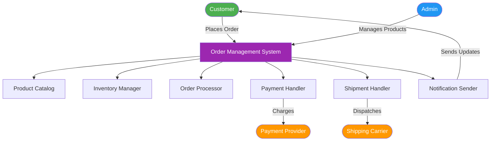
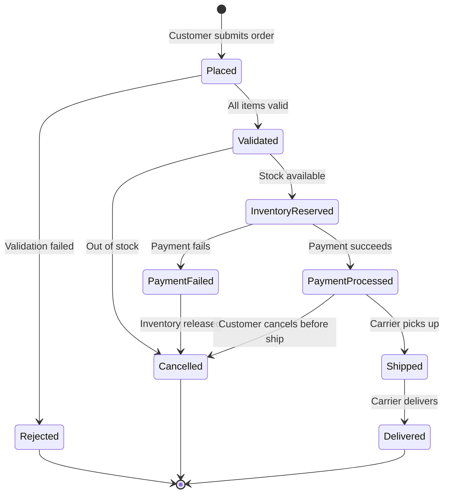
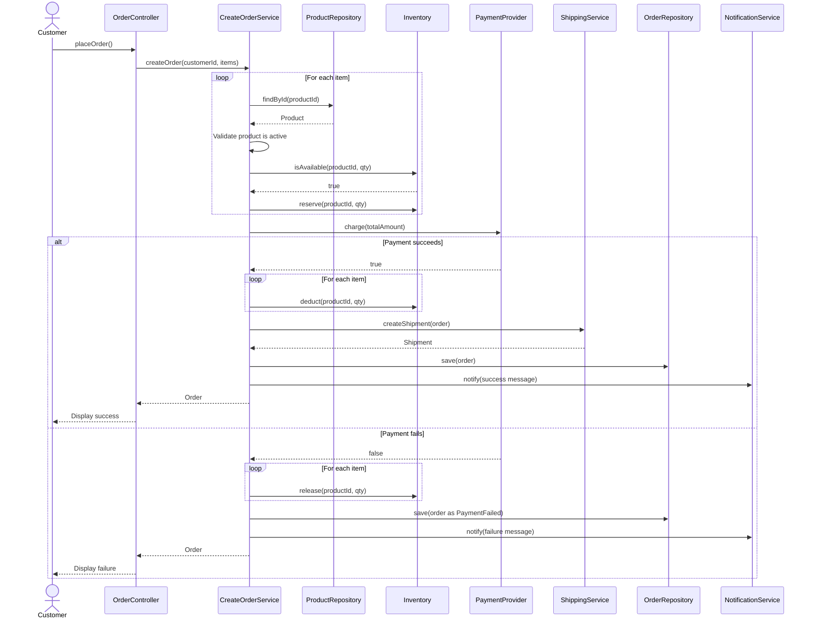
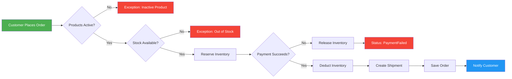

# Smart Order Management System (OMS)

A learning project demonstrating **OOP** and **SOLID** principles in C++17.

---

## Table of Contents

- [Business Model](#business-model)
- [Project Structure](#project-structure)
- [Domain Concepts](#domain-concepts)
- [System Flow](#system-flow)
- [Diagrams](#diagrams)

---

## Business Model

### Problem

An online store needs to:
- Track product catalog and inventory levels
- Process customer orders reliably (validate, pay, ship)
- Handle failures gracefully (payment declined, out of stock)
- Notify customers at every step

The OMS is the **central brain** coordinating Products, Inventory, Orders, Payments, and Shipments.

### Actors

| Actor | Role |
|---|---|
| **Customer** | Places orders, receives notifications |
| **Admin** | Manages products, monitors orders |
| **System (OMS)** | Validates, coordinates, enforces rules |
| **Payment Provider** | Charges/refunds money (external) |
| **Shipping Carrier** | Delivers packages (external) |

### Order Lifecycle

```
PLACED → VALIDATED → INVENTORY_RESERVED → PAYMENT_PROCESSED → SHIPPED → DELIVERED
```

Failure paths:
- Validation fails → **REJECTED**
- Out of stock → **CANCELLED**
- Payment fails → **PAYMENT_FAILED** (inventory released)
- Customer cancels (before shipped) → **CANCELLED** (refund + release)

---

**Dependency Rule**: Upper layers depend on lower layers through **abstractions** (interfaces), never on concrete implementations.

---

## Project Structure

```
Order Management System/
├── main.cpp                          # Entry point — Manual DI wiring
├── CMakeLists.txt                    # Build configuration
├── README.md
│
├── include/
│   ├── domain/
│   │   ├── enum/
│   │   │   ├── EOrderStatus.h
│   │   │   ├── EPaymentStatus.h
│   │   │   └── EShipmentStatus.h
│   │   ├── Product.h
│   │   ├── OrderItem.h
│   │   ├── Order.h
│   │   ├── Inventory.h
│   │   ├── Payment.h
│   │   └── Shipment.h
│   │
│   ├── application/
│   │   ├── Interface/
│   │   │   ├── IOrderRepository.h
│   │   │   ├── IProductRepository.h
│   │   │   ├── IPaymentProvider.h
│   │   │   ├── IShippingService.h
│   │   │   └── INotificationService.h
│   │   ├── CreateOrderService.h
│   │   ├── CancelOrderService.h
│   │   └── ProcessPaymentService.h
│   │
│   ├── infrastructure/
│   │   ├── InMemoryOrderRepository.h
│   │   ├── InMemoryProductRepository.h
│   │   ├── FakePaymentProvider.h
│   │   ├── FakeShippingService.h
│   │   └── ConsoleNotificationService.h
│   │
│   └── presentation/
│       └── OrderController.h
│
└── src/
    ├── domain/
    │   ├── Product.cpp
    │   ├── OrderItem.cpp
    │   ├── Order.cpp
    │   ├── Inventory.cpp
    │   ├── Payment.cpp
    │   └── Shipment.cpp
    │
    ├── application/
    │   ├── CreateOrderService.cpp
    │   ├── CancelOrderService.cpp
    │   └── ProcessPaymentService.cpp
    │
    ├── infrastructure/
    │   ├── InMemoryOrderRepository.cpp
    │   ├── InMemoryProductRepository.cpp
    │   ├── FakePaymentProvider.cpp
    │   ├── FakeShippingService.cpp
    │   └── ConsoleNotificationService.cpp
    │
    └── presentation/
        └── OrderController.cpp
```

---

## Domain Concepts

### Product
- Catalog entry: id, name, price, active flag
- Rules: price > 0, name not empty, inactive products can't be sold

### Inventory
- Tracks `total` and `reserved` quantities per product
- Available = total − reserved
- Operations: `reserve`, `release`, `deduct`, `restock`
- Rule: available can never go negative

### Order
- Central document: orderId, list of OrderItems, totalAmount, status, timestamp
- Rules: at least one item, valid state transitions only, terminal states are final
- State transitions enforced by `changeStatus()` guard

### OrderItem
- Holds a Product reference + quantity + computed lineTotal
- Rule of Five implemented (raw pointer requires copy/move semantics)
- Rule: quantity >= 1

### Payment
- Status enum: Pending → Completed | Failed | Refunded
- Transitions: `markComplete()`, `markFailed()`, `refund()`

### Shipment
- Status enum: Pending → Shipped → Delivered
- Tracks address and carrier tracking number

---

## System Flow

### Place Order (Happy Path)

1. **Customer** submits order (product IDs + quantities)
2. **System** fetches Product details from ProductRepository
3. **System** validates product is active
4. **Inventory** checks availability and reserves stock
5. **PaymentProvider** charges the total amount
6. **Inventory** permanently deducts reserved stock
7. **ShippingService** creates shipment with tracking number
8. **OrderRepository** persists the order
9. **NotificationService** notifies customer

### Cancel Order

1. **System** fetches order from repository
2. **System** checks `canBeCancelled()` (only Placed / Validated / InventoryReserved)
3. **Inventory** releases reserved stock
4. **PaymentProvider** refunds the amount
5. **Order** status → Cancelled
6. **NotificationService** notifies customer

### Failure Handling

- **Product inactive** → Exception thrown, order not created
- **Out of stock** → Exception thrown, no reservation made
- **Payment fails** → Inventory released, status → PaymentFailed, order saved

---

## Diagrams

### High-Level System Overview



### Order Lifecycle — State Diagram



### Sequence Diagram — Place Order



### Workflow Diagram — Decision Flow



### Dependency Injection Wiring


