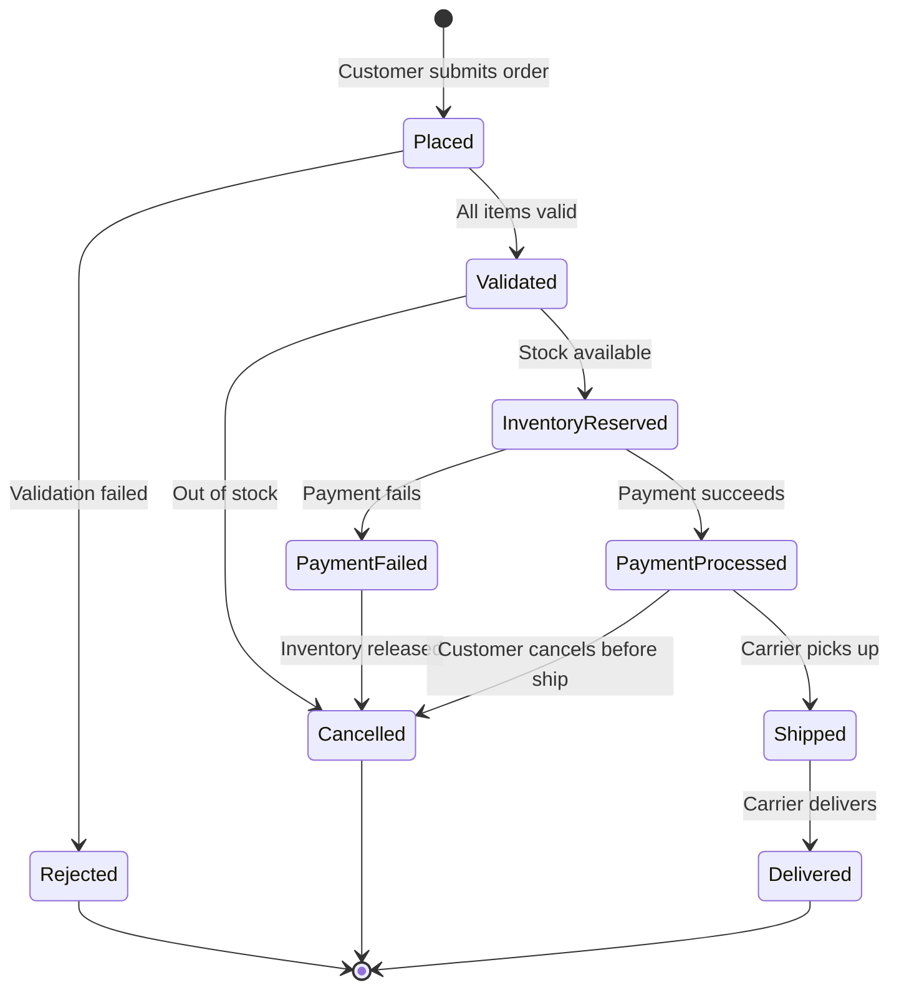
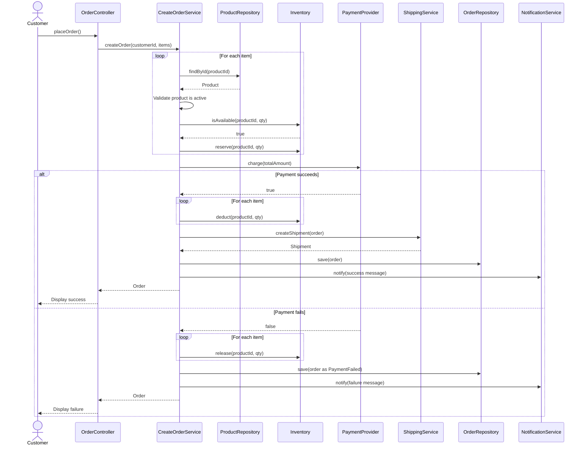
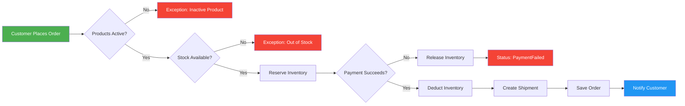
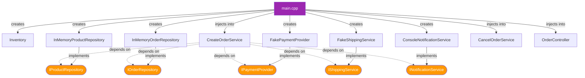
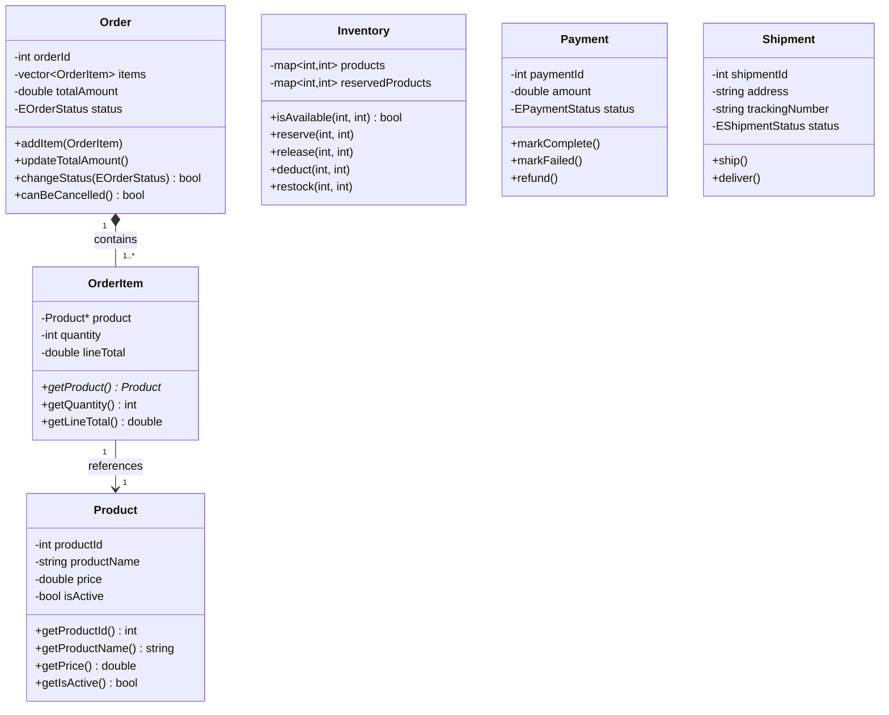

# Smart Order Management System (OMS)

A learning project demonstrating **OOP** and **SOLID** principles in C++17.

---

## Table of Contents

- [Business Model](#business-model)
- [Architecture Overview](#architecture-overview)
- [Project Structure](#project-structure)
- [Domain Concepts](#domain-concepts)
- [System Flow](#system-flow)
- [Diagrams](#diagrams)
- [SOLID Principles Applied](#solid-principles-applied)
- [Build & Run](#build--run)
- [Sample Output](#sample-output)
- [Enhancements Made](#enhancements-made)

---

## Business Model

### Problem

An online store needs to:
- Track product catalog and inventory levels
- Process customer orders reliably (validate, pay, ship)
- Handle failures gracefully (payment declined, out of stock)
- Notify customers at every step

The OMS is the **central brain** coordinating Products, Inventory, Orders, Payments, and Shipments.

### Actors

| Actor | Role |
|---|---|
| **Customer** | Places orders, receives notifications |
| **Admin** | Manages products, monitors orders |
| **System (OMS)** | Validates, coordinates, enforces rules |
| **Payment Provider** | Charges/refunds money (external) |
| **Shipping Carrier** | Delivers packages (external) |

### Order Lifecycle

```
PLACED → VALIDATED → INVENTORY_RESERVED → PAYMENT_PROCESSED → SHIPPED → DELIVERED
```

Failure paths:
- Validation fails → **REJECTED**
- Out of stock → **CANCELLED**
- Payment fails → **PAYMENT_FAILED** (inventory released)
- Customer cancels (before shipped) → **CANCELLED** (refund + release)

---

## Architecture Overview

The system follows a **layered architecture** with clear separation of concerns:

```
┌─────────────────────────────────────────┐
│           Presentation Layer            │
│         (OrderController - CLI)         │
├─────────────────────────────────────────┤
│           Application Layer             │
│  CreateOrderService  CancelOrderService │
│       ProcessPaymentService             │
├─────────────────────────────────────────┤
│             Domain Layer                │
│  Product  Order  OrderItem  Inventory   │
│  Payment  Shipment  Enums               │
├─────────────────────────────────────────┤
│         Infrastructure Layer            │
│  InMemoryOrderRepository                │
│  InMemoryProductRepository              │
│  FakePaymentProvider                    │
│  FakeShippingService                    │
│  ConsoleNotificationService             │
└─────────────────────────────────────────┘
```

**Dependency Rule**: Upper layers depend on lower layers through **abstractions** (interfaces), never on concrete implementations.

---

## Project Structure

```
Order Management System/
├── main.cpp                          # Entry point — Manual DI wiring
├── CMakeLists.txt                    # Build configuration
├── README.md
│
├── include/
│   ├── domain/
│   │   ├── enum/
│   │   │   ├── EOrderStatus.h
│   │   │   ├── EPaymentStatus.h
│   │   │   └── EShipmentStatus.h
│   │   ├── Product.h
│   │   ├── OrderItem.h
│   │   ├── Order.h
│   │   ├── Inventory.h
│   │   ├── Payment.h
│   │   └── Shipment.h
│   │
│   ├── application/
│   │   ├── Interface/
│   │   │   ├── IOrderRepository.h
│   │   │   ├── IProductRepository.h
│   │   │   ├── IPaymentProvider.h
│   │   │   ├── IShippingService.h
│   │   │   └── INotificationService.h
│   │   ├── CreateOrderService.h
│   │   ├── CancelOrderService.h
│   │   └── ProcessPaymentService.h
│   │
│   ├── infrastructure/
│   │   ├── InMemoryOrderRepository.h
│   │   ├── InMemoryProductRepository.h
│   │   ├── FakePaymentProvider.h
│   │   ├── FakeShippingService.h
│   │   └── ConsoleNotificationService.h
│   │
│   └── presentation/
│       └── OrderController.h
│
└── src/
    ├── domain/
    │   ├── Product.cpp
    │   ├── OrderItem.cpp
    │   ├── Order.cpp
    │   ├── Inventory.cpp
    │   ├── Payment.cpp
    │   └── Shipment.cpp
    │
    ├── application/
    │   ├── CreateOrderService.cpp
    │   ├── CancelOrderService.cpp
    │   └── ProcessPaymentService.cpp
    │
    ├── infrastructure/
    │   ├── InMemoryOrderRepository.cpp
    │   ├── InMemoryProductRepository.cpp
    │   ├── FakePaymentProvider.cpp
    │   ├── FakeShippingService.cpp
    │   └── ConsoleNotificationService.cpp
    │
    └── presentation/
        └── OrderController.cpp
```

---

## Domain Concepts

### Product
- Catalog entry: id, name, price, active flag
- Rules: price > 0, name not empty, inactive products can't be sold

### Inventory
- Tracks `total` and `reserved` quantities per product
- Available = total − reserved
- Operations: `reserve`, `release`, `deduct`, `restock`
- Rule: available can never go negative

### Order
- Central document: orderId, list of OrderItems, totalAmount, status, timestamp
- Rules: at least one item, valid state transitions only, terminal states are final
- State transitions enforced by `changeStatus()` guard

### OrderItem
- Holds a Product reference + quantity + computed lineTotal
- Rule of Five implemented (raw pointer requires copy/move semantics)
- Rule: quantity >= 1

### Payment
- Status enum: Pending → Completed | Failed | Refunded
- Transitions: `markComplete()`, `markFailed()`, `refund()`

### Shipment
- Status enum: Pending → Shipped → Delivered
- Tracks address and carrier tracking number

---

## System Flow

### Place Order (Happy Path)

1. **Customer** submits order (product IDs + quantities)
2. **System** fetches Product details from ProductRepository
3. **System** validates product is active
4. **Inventory** checks availability and reserves stock
5. **PaymentProvider** charges the total amount
6. **Inventory** permanently deducts reserved stock
7. **ShippingService** creates shipment with tracking number
8. **OrderRepository** persists the order
9. **NotificationService** notifies customer

### Cancel Order

1. **System** fetches order from repository
2. **System** checks `canBeCancelled()` (only Placed / Validated / InventoryReserved)
3. **Inventory** releases reserved stock
4. **PaymentProvider** refunds the amount
5. **Order** status → Cancelled
6. **NotificationService** notifies customer

### Failure Handling

- **Product inactive** → Exception thrown, order not created
- **Out of stock** → Exception thrown, no reservation made
- **Payment fails** → Inventory released, status → PaymentFailed, order saved

---

## Diagrams

### High-Level System Overview


### Order Lifecycle — State Diagram



### Sequence Diagram — Place Order



### Workflow Diagram — Decision Flow



### Dependency Injection Wiring



### Class Diagram — Domain Layer



---

## SOLID Principles Applied

| Principle | Where Applied |
|---|---|
| **S — Single Responsibility** | Each class has one job: `Order` manages state, `Inventory` manages stock, `Payment` tracks transactions. Services orchestrate — domain objects don't call external services. |
| **O — Open/Closed** | New payment providers (Stripe, PayPal) or notification channels (SMS, Email) can be added by implementing interfaces — no existing code modified. |
| **L — Liskov Substitution** | `FakePaymentProvider` and any future `StripePaymentProvider` are interchangeable via `IPaymentProvider&`. All subtypes fulfil the base contract. |
| **I — Interface Segregation** | `INotificationService` only has `notify()`. `IShippingService` only has `createShipment()`. No fat interfaces — clients aren't forced to depend on methods they don't use. |
| **D — Dependency Inversion** | Services depend on abstractions (`IOrderRepository`, `IPaymentProvider`, etc.), not concrete implementations. All wiring happens in `main.cpp`. |

---

## Build & Run

### Prerequisites
- **g++** with C++17 support (MinGW / MSYS2 / GCC 8+)

### Compile

```bash
g++ -std=c++17 -I include -o oms.exe main.cpp \
  src/domain/Product.cpp \
  src/domain/OrderItem.cpp \
  src/domain/Order.cpp \
  src/domain/Inventory.cpp \
  src/domain/Payment.cpp \
  src/domain/Shipment.cpp \
  src/application/CreateOrderService.cpp \
  src/application/CancelOrderService.cpp \
  src/application/ProcessPaymentService.cpp \
  src/infrastructure/InMemoryOrderRepository.cpp \
  src/infrastructure/InMemoryProductRepository.cpp \
  src/infrastructure/FakePaymentProvider.cpp \
  src/infrastructure/FakeShippingService.cpp \
  src/infrastructure/ConsoleNotificationService.cpp \
  src/presentation/OrderController.cpp
```

### Run

```bash
./oms.exe
```

---

## Sample Output

```
========================================
  Seed Data Loaded:
  Product 1: Wireless Mouse    $29.99  (50 in stock)
  Product 2: Mechanical Keyboard $79.99 (30 in stock)
  Product 3: USB-C Hub         $49.99  (20 in stock)
  Product 4: Monitor Stand     $39.99  (INACTIVE)
========================================

========================================
   Order Management System (OMS)
========================================
  1. Place Order
  2. Cancel Order
  3. Show Order
  0. Exit
========================================
Choose: 1

===== Place New Order =====
Enter Customer ID: 1
Enter Product ID: 1
Enter Quantity: 2
Add another item? (y/n): y
Enter Product ID: 2
Enter Quantity: 1
Add another item? (y/n): n
[Payment] Charged $139.97 successfully.
[Shipping] Shipment #5000 created for Order #1 | Tracking: TRK-102379
[Notification] Order created successfully

>> Order #1 created successfully! Total: $139.97 | Status: Payment Processed

Choose: 3
Enter Order ID: 1
----------------------------------------
Order ID   : 1
Status     : Payment Processed
Total      : $139.97
Items      : 2
  [1] Product: Wireless Mouse (ID: 1) | Qty: 2 | Line: $59.98
  [2] Product: Mechanical Keyboard (ID: 2) | Qty: 1 | Line: $79.99
----------------------------------------
```

---

## Enhancements Made

1. **Rule of Five** on `OrderItem` — prevents double-free when stored in `std::vector`
2. **EPaymentStatus** / **EShipmentStatus** enums — replaced ambiguous `bool` flags
3. **IProductRepository** — services fetch real product data instead of constructing placeholders
4. **Status transition guards** — `changeStatus()` rejects illegal transitions; `canBeCancelled()` checks multiple valid states
5. **Constructor validation** — `Order` rejects invalid IDs; `OrderItem` rejects qty <= 0
6. **Manual Dependency Injection** — all wiring in `main.cpp`, no service locators
7. **Clean layered architecture** — Domain has zero dependencies on Infrastructure

---

*Built as a learning project for OOP + SOLID principles in C++17.*
